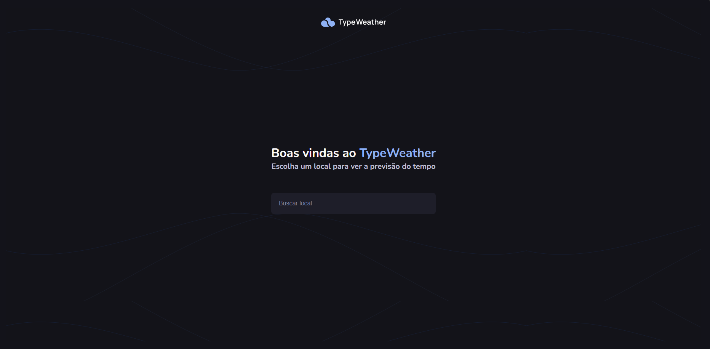
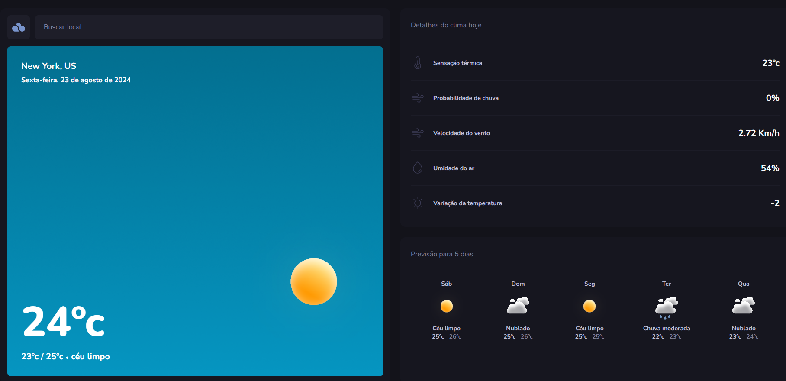

# TypeWeather

> Projeto desenvolvido pela empresa [Rocketseat](https://app.rocketseat.com.br) programa Explorer.
O TypeWeather é um aplicativo avançado de previsão do tempo, projetado para oferecer aos usuários uma experiência completa ao acompanhar as condições meteorológicas. Com o TypeWeather, é possível pesquisar o clima de diferentes localidades e obter informações detalhadas como temperatura atual, sensação térmica, probabilidade de precipitação, velocidade do vento, umidade relativa do ar e variações de temperatura ao longo do dia.

Além dessas funcionalidades, o TypeWeather se destaca por fornecer previsões precisas para os próximos 5 dias, permitindo que os usuários se preparem para mudanças climáticas com antecedência. O aplicativo também apresenta gráficos intuitivos que mostram tendências de temperatura e condições meteorológicas ao longo do tempo, oferecendo uma visão clara das flutuações climáticas.

Com uma interface amigável e fácil de usar, o TypeWeather é a ferramenta ideal para quem deseja estar sempre bem informado sobre o clima, seja para planejar viagens, atividades ao ar livre ou apenas para se manter atualizado sobre as condições meteorológicas de sua região.

> Esta aplicação faz uso da Api [OpenWeather](https://openweathermap.org/)

## Interface do Usuário

A interface inicial do TypeWeather possui uma barra de pesquisa na qual os usuários podem inserir o nome do local que desejam verificar. Ao clicar no resultado da pesquisa, eles são direcionados para uma página de detalhes que exibe informações detalhadas sobre o clima, incluindo:

- **Temperatura:** 30°C
- **Sensação Térmica:** 30°C
- **Probabilidade de Chuva:** 1%
- **Velocidade do Vento:** 7.72 Km/h
- **Umidade do Ar:** 51%
- **Variação da Temperatura:** 0.

## Tecnologias Utilizadas

O projeto TypeWeather foi desenvolvido com as seguintes tecnologias:

- React
- React Router Dom
- Axios
- Day.js
- Vite (Bundler)
- TypeScript
- ESLint (Ferramenta de Linting)

## Contatos

Se tiver alguma dúvida, sugestão ou feedback, sinta-se à vontade para entrar em contato:

- [LinkedIn](https://www.linkedin.com/in/denilson-bernardo/)
- Email: denilsonbnasciemnto07@gmail.com
- WhatsApp: 011978635333
